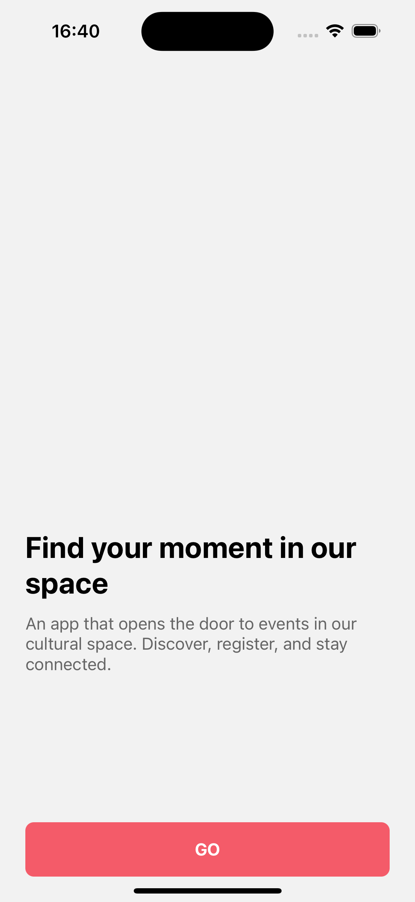
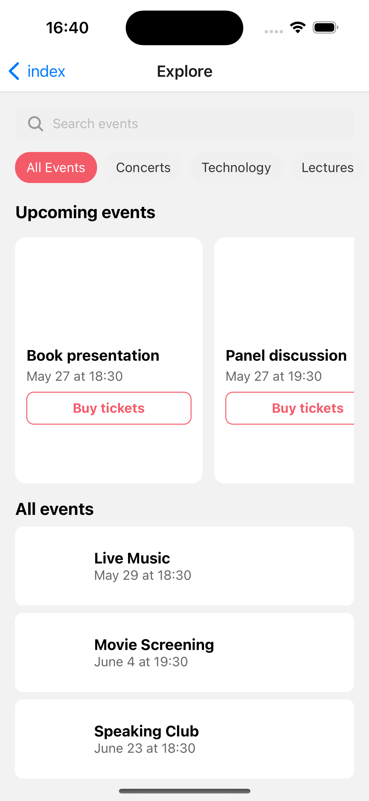
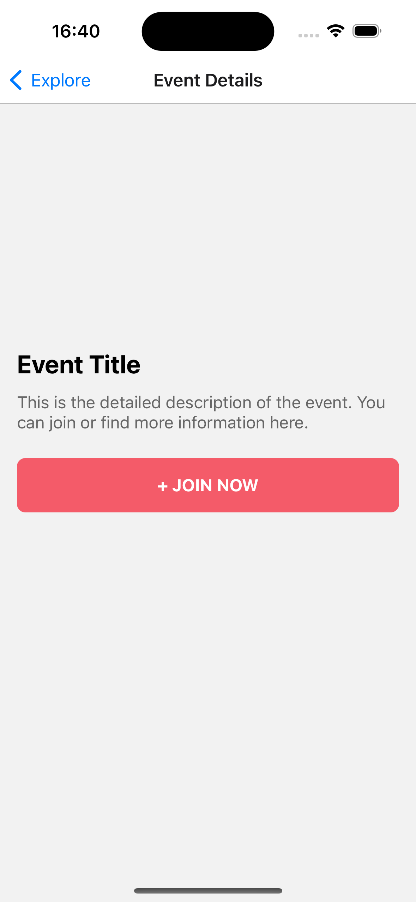
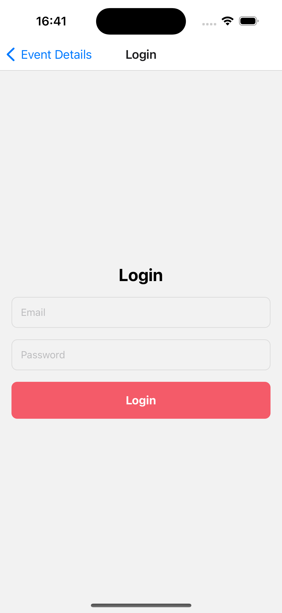

# Homework 6 — React Native UI Components

## Screenshots

### 1. Welcome Screen

- Components: `PrimaryButton`
- Description: Welcome screen with navigation to the Explore screen.



---

### 2. Explore Screen

- Components: `SearchBar`, `CategoryBadge`, `EventCard`, `EventListItem`
- Description: Main screen with category filters, horizontal event list, and vertical event list.



---

### 3. Event Details Screen

- Components: `PrimaryButton`
- Description: Event detail screen with join button and event description.



---

### 4. Login Screen

- Components: `AuthInput`, `PrimaryButton`
- Description: Simple login form with email and password inputs.



---

# Welcome to your Expo app 👋

This is an [Expo](https://expo.dev) project created with [`create-expo-app`](https://www.npmjs.com/package/create-expo-app).

## Get started

1. Install dependencies

   ```bash
   npm install
   ```
